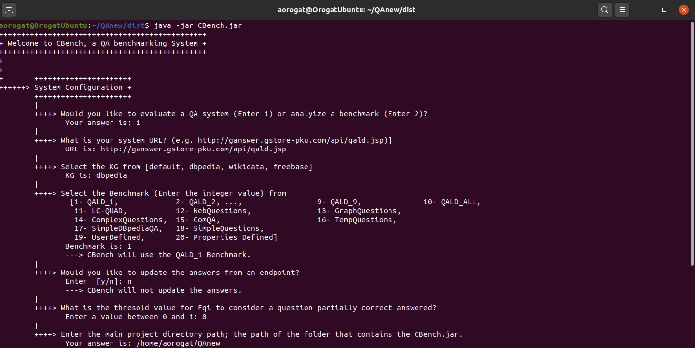

# CBench: QA Evaluation Mode
This document shows you how to configure CBench to evaluate a QA system and what you expect from CBench.
* __Run CBench.jar__ Using the command ``` java -jar "PATH/TO/projectFolder/CBench.jar" ```, run the project or change the current directory in the terminal to the directory where CBench located and run this command ``` java -jar CBench.jar ```.
* __Configure CBench__ This is the first step after running CBench. You have to configure the system as shown

* The System then preprocess the questions and print all of them as in the figure below.  QALD-1 has 100 questions, just 3 of them are shown.

* The System then prints some statistics as shown.

* CBench system collects the QA system answers. For every question, CBench prints the NLQ, Correct answers list and System answers list. s in the second imges, ot is better to unwrap tet as some answers are very long.


## User-Defined Benchmark
If you would like to analyze your own benchmark, Open the ```usrDefined.json``` file from the ```data``` folder on your project and replace the questions inside it with your questions using the same format.

 Do not forget, choose option 19 when configuring CBench.
 
