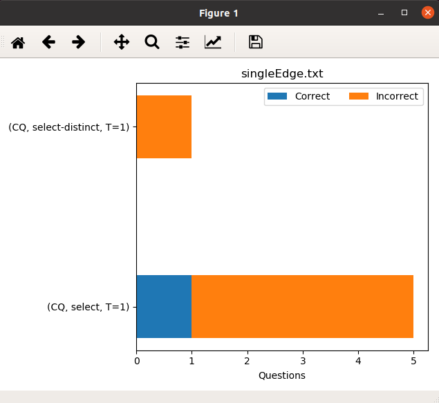
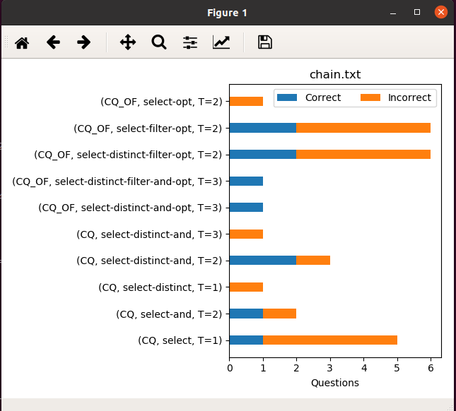
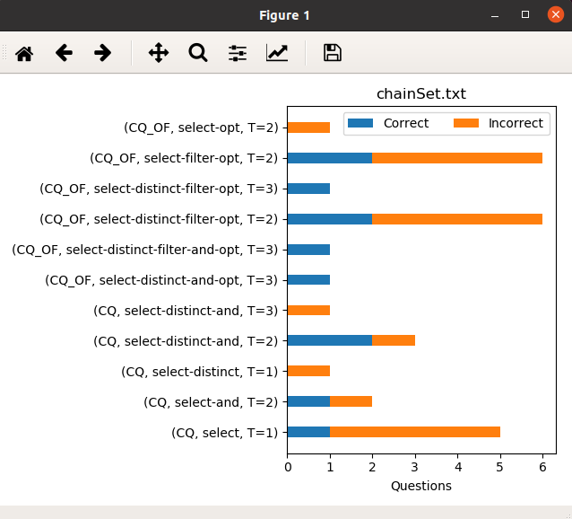
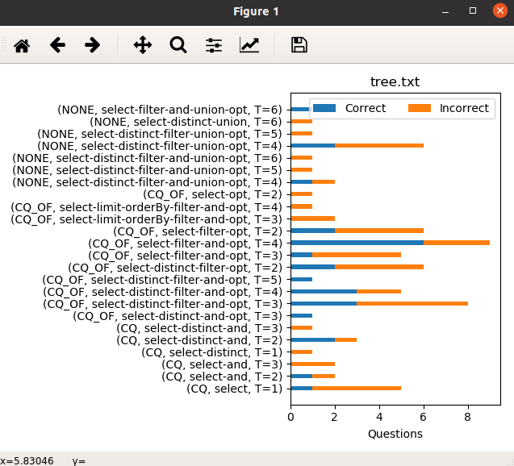
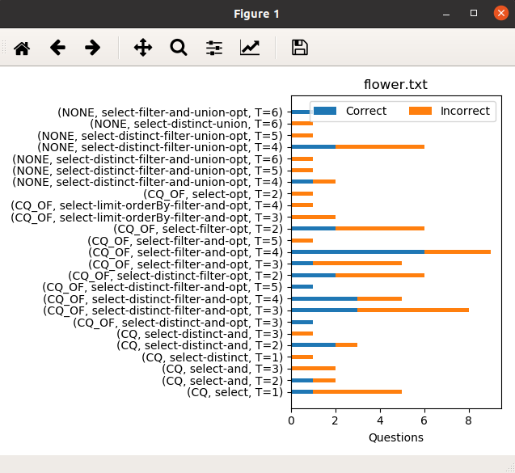
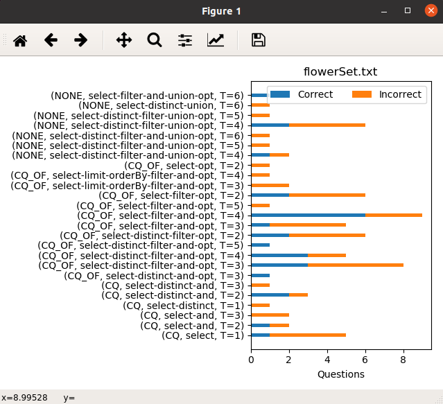
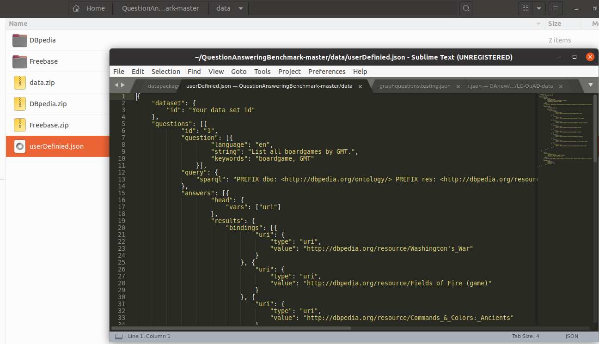

[Home](https://github.com/aelroby/CBench/)
# CBench: QA Evaluation Mode
This document shows you how to configure CBench to evaluate a QA system and what you expect from CBench.
* __Run CBench.jar__ Using the command ``` java -jar "PATH/TO/projectFolder/CBench.jar" ```, run the project or change the current directory in the terminal to the directory where CBench located and run this command ``` java -jar CBench.jar ```.
* __Configure CBench__ This is the first step after running CBench. You have to configure the system as shown

* The System then preprocess the questions and print all of them as in the figure below.  QALD-1 has 100 questions, just 3 of them are shown.

* The System then prints some statistics as shown.

* CBench system collects the QA system answers. For every question, CBench prints the NLQ, Correct answers list and System answers list. It is better to unwrap text as some answers are very long as in the second image.


* After CBench feeding the QA system with all questions, It will ask you if you would like to see the evaluation of the individual questions. 

Please select `yes` if you would like to take (Copy/Paste in Spreadsheet) these questions for your own analysis. If `yes` is selected, you will see a list of questions as in the image. (R: Recall, P: Precision and F1: F1 score for each question).

* CBench will ask you if you would like to see the evaluation of the individual questions categorized by their queries' shapes. Please select `yes` if you would like. 

In that case, as some shapes are subsuming others, we print questions for every shape that does not belong to other shapes.

* Then the final scores are reported

* Then you can visualize the properties of the questions that are correctly/incorrectly answered.

Then the data will be visualized by Matplotlib as shown. The images will appear one by one. To see the next image please close the current one.









## User-Defined Benchmark
If you would like to evaluate the QA system based on your own benchmark, Open the ```usrDefined.json``` file from the ```data``` folder on your project and replace the questions inside it with your questions using the same format.

 Do not forget, choose option 19 when configuring CBench.

 
 ## Debugging Benchmark Mode
 If you would like to select a set of questions that have specific properties, select option `20- Properties Defined` while configuring the system. Then, CBench will ask you about the properties of the targeted questions as shown.
 

